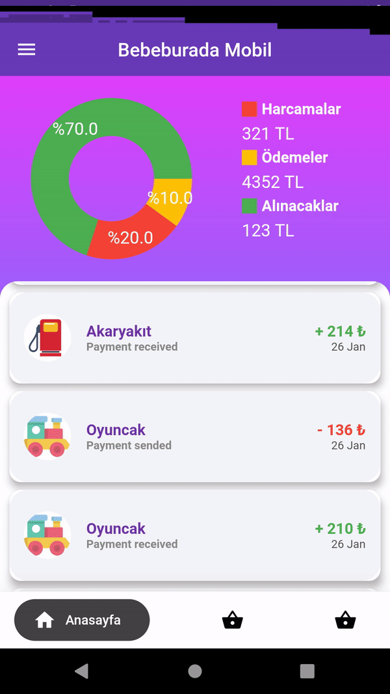

# MobilandWebsiteConnWithAPI
Web servis kullanarak e-ticaret sitesi ve mobil uygulama bağlantı ve yönetimi.

Tarafımdan geliştirilip yayınlanmış olan satış sitesinin stok,satış,sipariş,gelir-gider v.b. gibi verilerin işletme sahipleri tarafından mobil ortamda yönetim ve takibini yapmak amacıyla android uygulamasını takıp arkadaşım ile geliştirmiş bulunmaktayım.

Söz konusu mobil uygulamanın ilk etapta, tasarım ve page fonksiyonları diğer ekip üyesi tarafından geliştirildi. Bu doğrultuda MYSQL veri tabanında bulunan söz konusu gerekli bilgiler, Web API yapısı kullanarak mobil uygulamaya entegrasyon işlemi gerçekleştirildi.

<h3>Web Site</h3>

 

 

<h3>Mobil Uygulama</h3>

